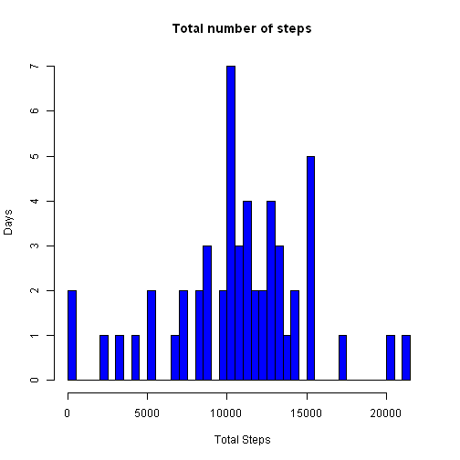
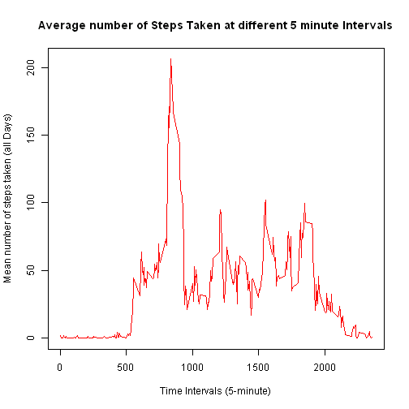
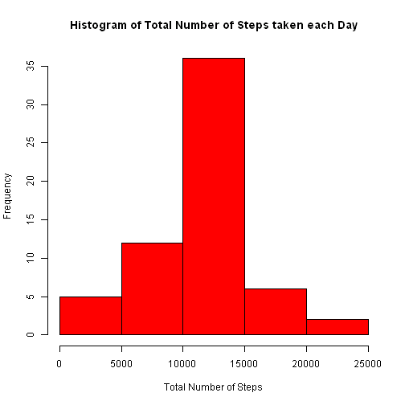
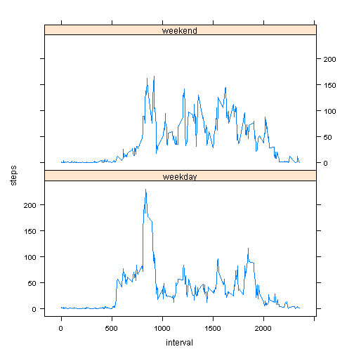

## Reproducible Research - PeerAssessment1

---
###Loading and preprocessing the data

1. Load the data


```r
Activity_data <- read.csv("activity.csv",header = T,
                 na.string="NA", stringsAsFactors=FALSE)
```

```
## Warning in file(file, "rt"): cannot open file 'activity.csv': No such file
## or directory
```

```
## Error in file(file, "rt"): cannot open the connection
```

2. Process/transform the data (if necessary) into a format suitable for your analysis


```r
#Group Steps by Date using aggregate function
Activity_Per_Day  <- aggregate(steps~date,Activity_Data,
                                sum,na.action = NULL)
```


###What is mean total number of steps taken per day?

3. Make a histogram of the total number of steps taken each day


```r
#Added breaks = 60 as there are 61 days data in total.
hist(Activity_Per_Day$steps,breaks=60,xlim = c(0,22000),
     xlab="Total Steps",ylab="Days",
     main = "Total number of steps",col="blue")
```

 

4. Calculate and report the mean and median total number of steps taken per day

**Mean**

```r
mean(Activity_Per_Day$steps,na.rm=T)
```

```
## [1] 10766.19
```
**Median**

```r
median(Activity_Per_Day$steps,na.rm=T)
```

```
## [1] 10765
```


###5.  What is the average daily activity pattern?

**Make a time series plot (i.e. type = “l”) of the 5-minute interval (x-axis) and the average number of steps taken, averaged across all days (y-axis)**


```r
stepsInterval <- aggregate(steps ~ interval, data = activity_data, mean, na.rm = TRUE)
plot(steps ~ interval, data = stepsInterval, type = "l", xlab = "Time Intervals (5-minute)", 
    ylab = "Mean number of steps taken (all Days)", main = "Average number of Steps Taken at different 5 minute Intervals", 
    col = "red")
```

 

**Which 5-minute interval, on average across all the days in the dataset, contains the maximum number of steps?**


```r
stepsInterval[stepsInterval$steps==max(stepsInterval$steps),]
```

```
##     interval    steps
## 104      835 206.1698
```
It is the **835th** interval.

###Imputing missing values

6.  Calculate and report the total number of missing values in the dataset (i.e. the total number of rows with NAs)

```r
sum(is.na(Activity_Data$steps))
```

```
## [1] 2304
```

Total 2304 rows are missing.

 Devise a strategy for filling in all of the missing values in the dataset. The strategy does not need to be sophisticated. For example, you could use the mean/median for that day, or the mean for that 5-minute interval, etc.


```r
#This function helps in fetching steps for a particular interval
interval2steps <- function(interval) {
    stepsInterval[stepsInterval$interval == interval, ]$steps
}
```
Create a new dataset that is equal to the original dataset but with the missing data filled in.


```r
#Wherever there are missing steps values, replace them with the 
#steps values of that particular interval
#This does not disturb the summary of the data

activityFilled <- activity_data
count = 0
for (i in 1:nrow(activityFilled)) {
    if (is.na(activityFilled[i, ]$steps)) {            
        activityFilled[i, ]$steps <- interval2steps(activityFilled[i, ]$interval)
        count = count + 1
    }
}
cat("Total ", count, "NA values were filled.\n")
```

```
## Total  2304 NA values were filled.
```

7.  Make a histogram of the total number of steps taken each day and Calculate and report the mean and median total number of steps taken per day

```r
totalStepsPerDays <- aggregate(steps ~ date, data = activityFilled, sum)
hist(totalStepsPerDays$steps, col = "red", xlab = "Total Number of Steps", 
    ylab = "Frequency", main = "Histogram of Total Number of Steps taken each Day")
```

 


```r
mean(totalStepsPerDays$steps)
```

```
## [1] 10766.19
```


```r
median(totalStepsPerDays$steps)
```

```
## [1] 10766.19
```

**The mean and median of the new data set after imputing the NA values also have same mean and median without much deviation.  Hence, imputing is performed correctly!!**


###Are there differences in activity patterns between weekdays and weekends?

Create a new factor variable in the dataset with two levels – “weekday” and “weekend” indicating whether a given date is a weekday or weekend day.


```r
activityFilled$day = ifelse(as.POSIXlt(as.Date(activityFilled$date))$wday%%6 == 
    0, "weekend", "weekday")
# For Sunday and Saturday : weekend, Other days : weekday
activityFilled$day = factor(activityFilled$day, levels = c("weekday", "weekend"))
```

Make a panel plot containing a time series plot (i.e. type = “l”) of the 5-minute interval (x-axis) and the average number of steps taken, averaged across all weekday days or weekend days (y-axis). The plot should look something like the following, which was creating using simulated data:


```r
stepsInterval2 = aggregate(steps ~ interval + day, activityFilled, mean)
library(lattice)
xyplot(steps ~ interval | factor(day), data = stepsInterval2, aspect = 1/2, 
    type = "l")
```

 

